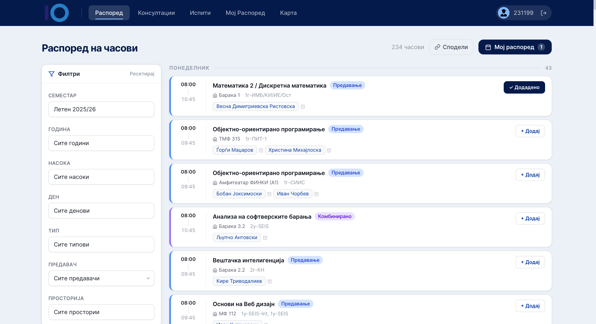
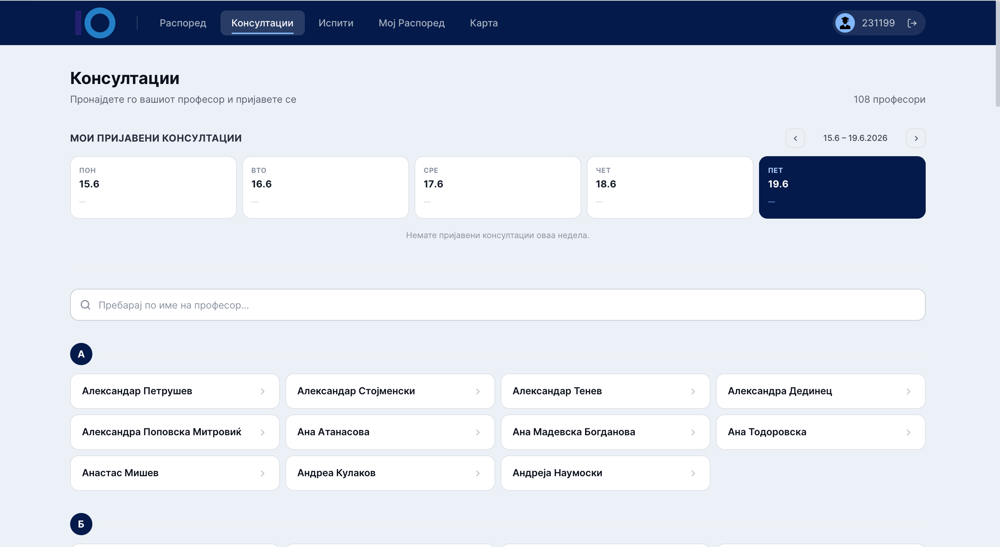

# ФИНКИ Распоред [FINKI SCHEDULE]

A web app for FINKI students to view their class timetable, browse professor
consultations, build a personal weekly schedule, and find rooms on a campus map.

  

## Features

| | |
|---|---|
| **Распоред [Schedule]** | Full faculty timetable with filters (year, program, day, professor, room) and one-click add to your schedule. |
| **Консултации[Consultations]** | Browse all professors and book consultation slots. |
| **Мој Распоред[My Schedule]** | Your personal weekly calendar — add classes, labs, and custom entries, then export to `.ics`. |
| **Карта[Map]** | Interactive map of the FINKI campus to locate rooms and buildings. |

### Screenshots

| Распоред | Консултации |
|---|---|
|  |  |
| **Испити** | **Мој Распоред** |
|  |  |
| **Карта** | **Почетна** |
|  |  |

## Tech stack

- **Frontend** — Next.js 14 (App Router, TypeScript, Tailwind)
- **Backend** — Spring Boot (Java 21), JWT auth
- **Database** — PostgreSQL 16
- **Data** — class timetable scraped from EduPage; consultations scraped from the FINKI site
