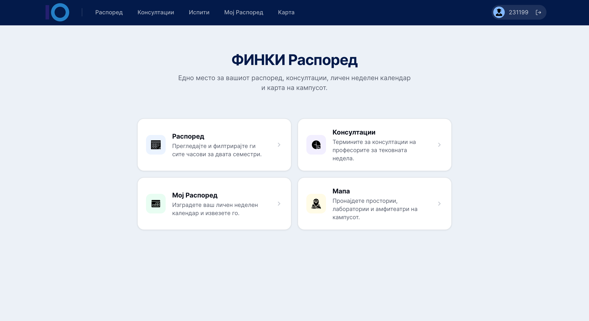
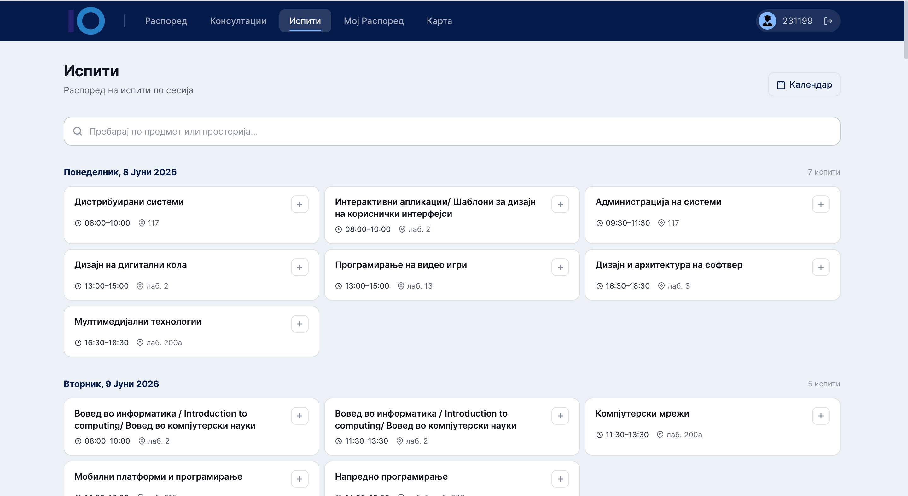

# ФИНКИ Распоред · FINKI Schedule

A web app for FINKI students to view their class timetable, browse professor consultations, build a personal weekly schedule, track exams, and find rooms on a campus map.

---

| Feature | Description |
|---------|-------------|
| **Распоред** · Schedule | Full faculty timetable with filters (year, program, day, professor, room) and one-click add to your schedule. |
| **Консултации** · Consultations | Browse all professors and book consultation slots. |
| **Мој Распоред** · My Schedule | Personal weekly calendar — add classes, labs, and custom entries, then export to `.ics`. |
| **Испити** · Exams | All your exams in one place — pin any exam to your personal schedule. |
| **Карта** · Map | Interactive map of the FINKI campus to locate rooms and buildings. |

---

## Tech Stack

| Layer | Technology |
|-------|-----------|
| **Frontend** | Next.js 14 (App Router, TypeScript, Tailwind CSS) |
| **Backend** | Spring Boot (Java 21), JWT Authentication |
| **Database** | PostgreSQL 16 |
| **Data** | Class timetable from EduPage; consultations from FINKI website |

---

## Screenshots

### Landing Page

### Распоред · Консултации

| Распоред | Консултации |
|----------|-------------|
|  |  |

### Мој Распоред · Испити

| Мој Распоред | Испити |
|-------------|--------|
|  |  |

### Карта · Campus Map

---

**Stefan Perovski** · [@steff221](https://github.com/steff221)
