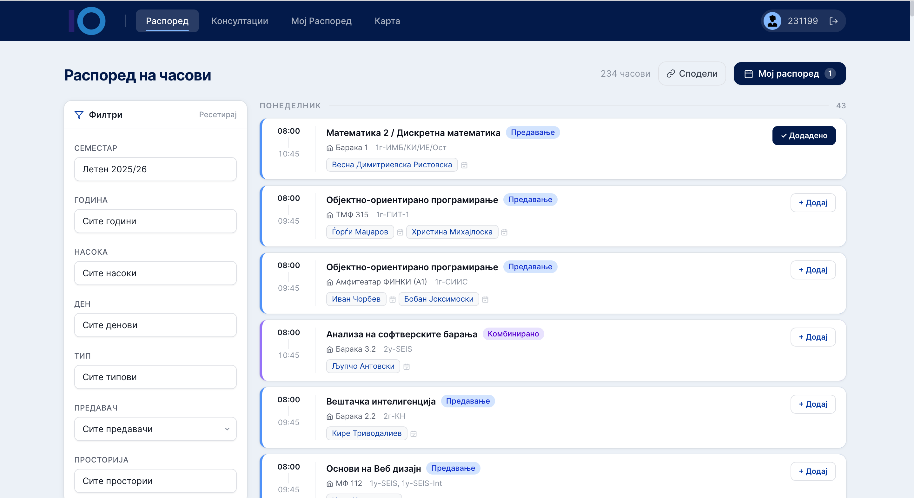
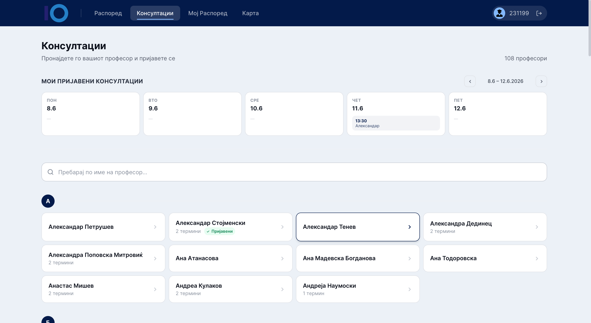
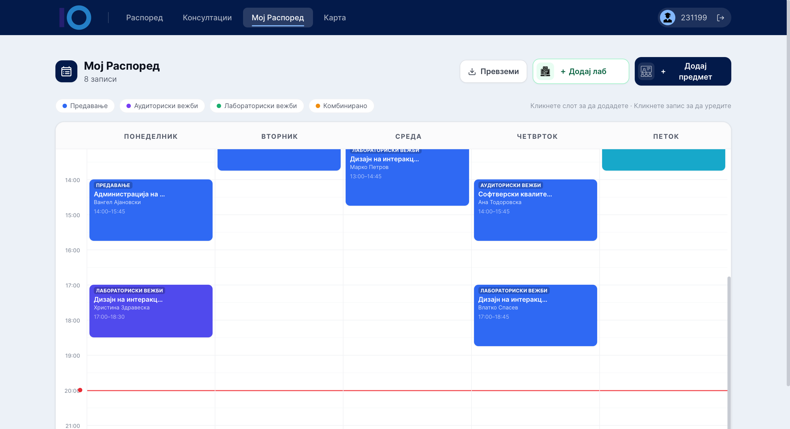
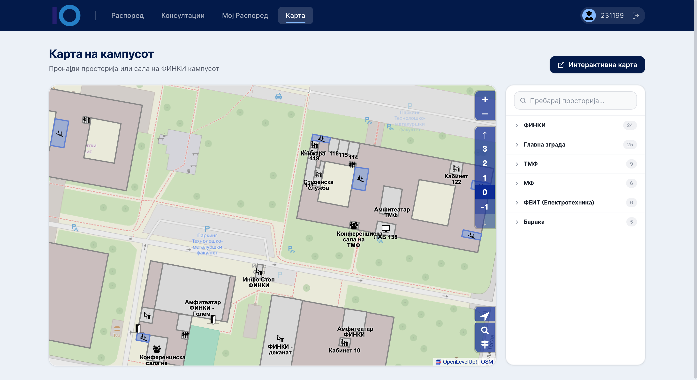

# ФИНКИ Распоред

A web app for FINKI students to view their class timetable, browse professor
consultations, build a personal weekly schedule, and find rooms on a campus map.

## Features

| | |
|---|---|
| **Распоред** | Full faculty timetable with filters (year, program, day, professor, room) and one-click add to your schedule. |
| **Консултации** | Browse all professors and book consultation slots. |
| **Мој Распоред** | Your personal weekly calendar — add classes, labs, and custom entries, then export to `.ics`. |
| **Карта** | Interactive map of the FINKI campus to locate rooms and buildings. |

### Screenshots

| Распоред | Консултации |
|---|---|
|  |  |
| **Мој Распоред** | **Карта** |
|  |  |

## Tech stack

- **Frontend** — Next.js 14 (App Router, TypeScript, Tailwind)
- **Backend** — Spring Boot (Java 21), JWT auth
- **Database** — PostgreSQL 16
- **Data** — class timetable scraped from EduPage; consultations scraped from the FINKI site

## Running it

```bash
cp .env.example .env   # then fill in DB_PASSWORD and JWT_SECRET
docker compose up --build
```

- Frontend → http://localhost:3000
- Backend API → http://localhost:8080

## Configuration

All settings live in `.env` (see `.env.example`):

| Variable | Purpose |
|---|---|
| `DB_PASSWORD` | PostgreSQL password |
| `JWT_SECRET` | JWT signing secret (min 32 chars) |
| `EDUPAGE_GSH` / `EDUPAGE_EDITION_YEAR` | EduPage timetable source |
| `NEXT_PUBLIC_API_URL` | Backend URL used by the frontend |
